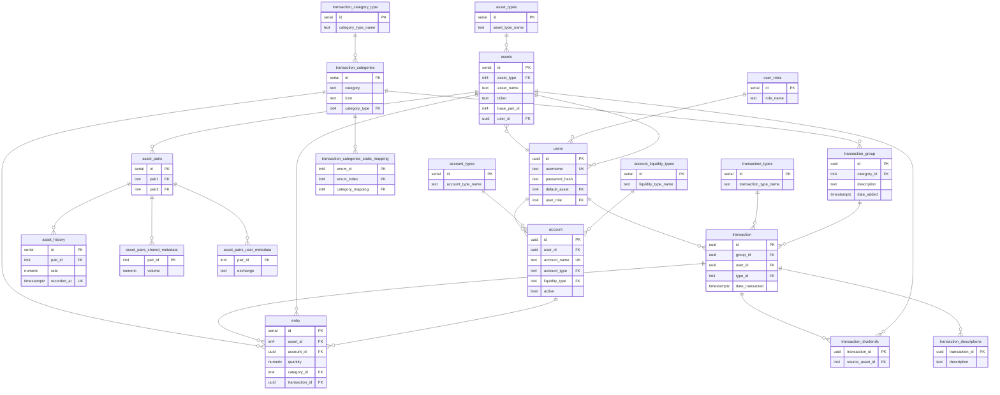

```mermaid
erDiagram

  account {
    uuid id PK
    uuid user_id FK
    text account_name UK
    int4 account_type FK
    int4 liquidity_type FK
    bool active
  }

  account_liquidity_types {
    serial id PK
    text liquidity_type_name
  }

  account_types {
    serial id PK
    text account_type_name
  }

  asset_history {
    serial id PK
    int4 pair_id FK
    numeric rate
    timestamptz recorded_at UK
  }

  asset_pairs {
    serial id PK
    int4 pair1 FK
    int4 pair2 FK
  }

  asset_pairs_shared_metadata {
    int4 pair_id PK
    numeric volume
  }

  asset_pairs_user_metadata {
    int4 pair_id PK
    text exchange
  }

  asset_types {
    serial id PK
    text asset_type_name
  }

  assets {
    serial id PK
    int4 asset_type FK
    text asset_name
    text ticker
    int4 base_pair_id
    uuid user_id FK
  }

  entry {
    serial id PK
    int4 asset_id FK
    uuid account_id FK
    numeric quantity
    int4 category_id FK
    uuid transaction_id FK
  }

  transaction {
    uuid id PK
    uuid group_id FK
    uuid user_id FK
    int4 type_id FK
    timestamptz date_transacted
  }

  transaction_categories {
    serial id PK
    text category
    text icon
    int4 category_type FK
  }

  transaction_categories_static_mapping {
    int4 enum_id PK
    int4 enum_index PK
    int4 category_mapping FK
  }

  transaction_category_type {
    serial id PK
    text category_type_name
  }

  transaction_descriptions {
    uuid transaction_id PK
    text description
  }

  transaction_dividends {
    uuid transaction_id PK
    int4 source_asset_id FK
  }

  transaction_group {
    uuid id PK
    int4 category_id FK
    text description
    timestamptz date_added
  }

  transaction_types {
    serial id PK
    text transaction_type_name
  }

  user_roles {
    serial id PK
    text role_name
  }

  users {
    uuid id PK
    text username UK
    text password_hash
    int4 default_asset FK
    int4 user_role FK
  }

  account ||--o{ entry : ""
  account_liquidity_types ||--o{ account : ""
  account_types ||--o{ account : ""
  asset_pairs ||--o{ asset_history : ""
  asset_pairs ||--o{ asset_pairs_shared_metadata : ""
  asset_pairs ||--o{ asset_pairs_user_metadata : ""
  asset_types ||--o{ assets : ""
  assets ||--o{ asset_pairs : ""
  assets ||--o{ entry : ""
  assets ||--o{ transaction_dividends : ""
  assets ||--o{ users : ""
  transaction ||--o{ entry : ""
  transaction ||--o{ transaction_descriptions : ""
  transaction ||--o{ transaction_dividends : ""
  transaction_categories ||--o{ entry : ""
  transaction_categories ||--o{ transaction_categories_static_mapping : ""
  transaction_categories ||--o{ transaction_group : ""
  transaction_category_type ||--o{ transaction_categories : ""
  transaction_group ||--o{ transaction : ""
  transaction_types ||--o{ transaction : ""
  user_roles ||--o{ users : ""
  users ||--o{ account : ""
  users ||--o{ assets : ""
  users ||--o{ transaction : ""

```
