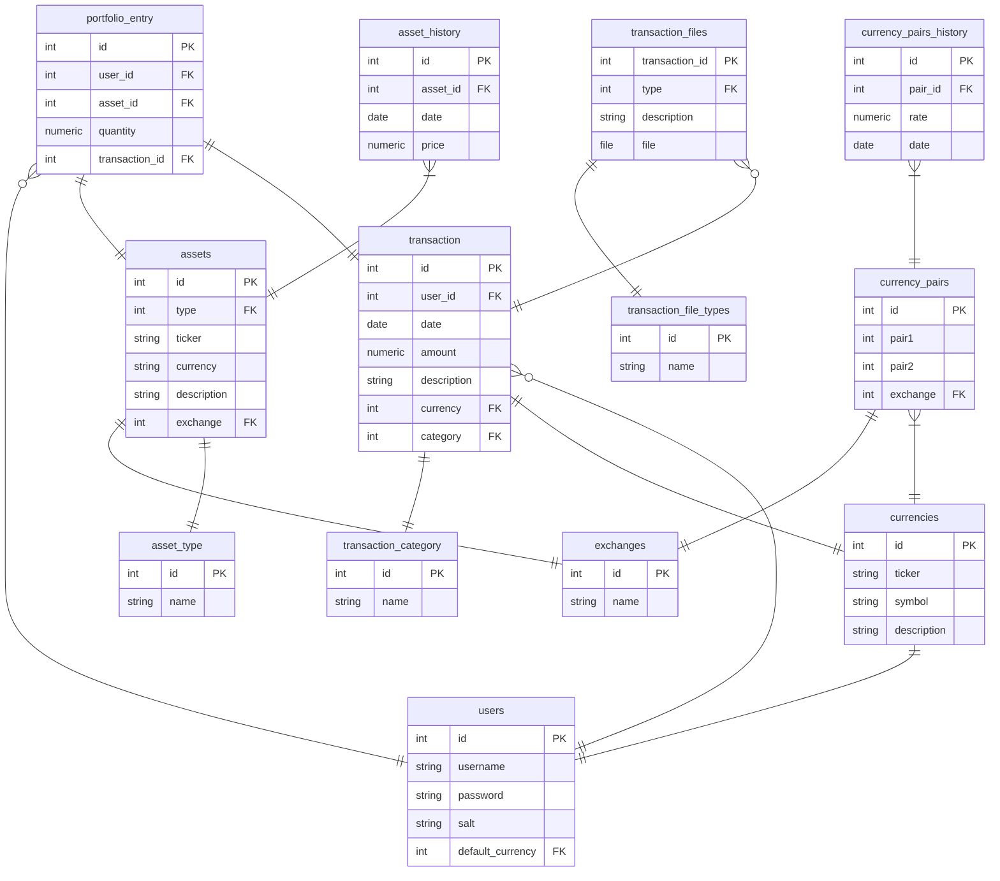

```mermaid
erDiagram
    users {
        int id PK
        string username
        string password
        string salt
        int default_currency FK
    }
    transaction {
        int id PK
        int user_id FK
        date date
        numeric amount
        string description
        int currency FK
        int category FK
    }
    transaction_category {
        int id PK
        string name
    }
    portfolio_entry {
        int id PK
        int user_id FK
        int asset_id FK
        numeric quantity
        int transaction_id FK
    }
    transaction_files {
        int transaction_id PK
        int type FK
        string description
        file file
    }
    transaction_file_types {
        int id PK
        string name
    }
    assets {
        int id PK
        int type FK
        string ticker
        string currency
        string description
        int exchange FK
    }
    asset_type {
        int id PK
        string name
    }
    asset_history {
        int id PK
        int asset_id FK
        date date
        numeric price
    }
    currencies {
        int id PK
        string ticker
        string symbol
        string description
    }
    currency_pairs {
        int id PK
        int pair1
        int pair2
        int exchange FK
    }
    currency_pairs_history {
        int id PK
        int pair_id FK
        numeric rate
        date date
    }
    exchanges {
        int id PK
        string name
    }
    transaction_files }o--|| transaction : ""
    transaction }o--|| users : ""
    asset_history }|--|| assets : ""
    currency_pairs_history }|--|| currency_pairs : ""
    currency_pairs }|--|| currencies : ""
    currencies ||--|| users : ""
    transaction ||--|| currencies : ""
    portfolio_entry ||--|| transaction : ""
    portfolio_entry ||--|| assets : ""
    assets ||--|| asset_type : ""
    assets ||--|| exchanges : ""
    currency_pairs ||--|| exchanges : ""
    transaction_files ||--|| transaction_file_types : ""
    transaction ||--|| transaction_category : ""
    portfolio_entry }o--|| users : ""

```