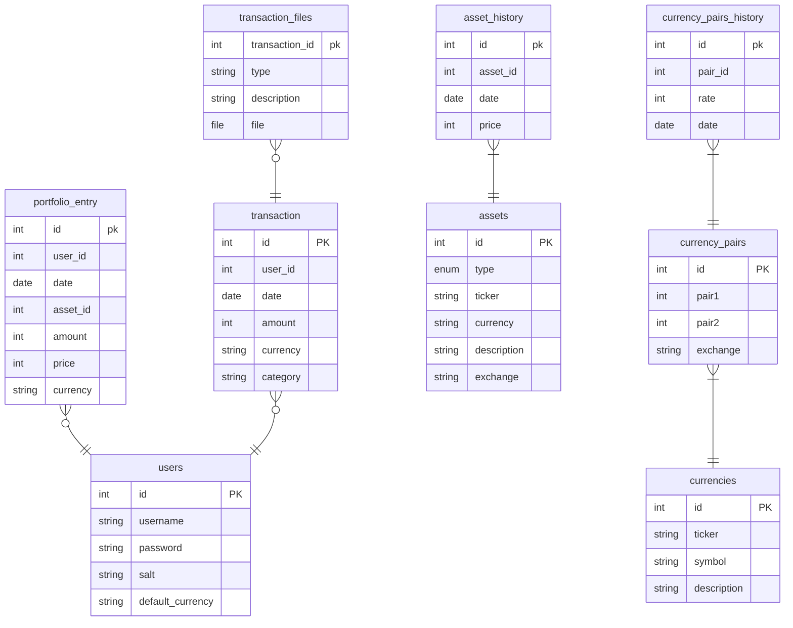

```mermaid
erDiagram
    users {
        int id PK
        string username
        string password
        string salt
        string default_currency
    }
    transaction {
        int id PK
        int user_id
        date date
        int amount
        string currency
        string category
    }
    portfolio_entry {
        int id pk
        int user_id
        date date
        int asset_id
        int amount
        int price
        string currency
    }
    transaction_files {
        int transaction_id pk
        string type
        string description
        file file
    }
    assets {
        int id PK
        enum type
        string ticker
        string currency
        string description
        string exchange
    }
    asset_history {
        int id pk
        int asset_id
        date date
        int price
    }
    currencies {
        int id PK
        string ticker
        string symbol
        string description
    }
    currency_pairs {
        int id PK
        int pair1
        int pair2
        string exchange
    }
    currency_pairs_history {
        int id pk
        int pair_id
        int rate
        date date
    }
    transaction_files }o--|| transaction : ""
    portfolio_entry }o--|| users : ""
    transaction }o--|| users : ""
    asset_history }|--|| assets : ""
    currency_pairs_history }|--|| currency_pairs : ""
    currency_pairs }|--|| currencies : ""
```