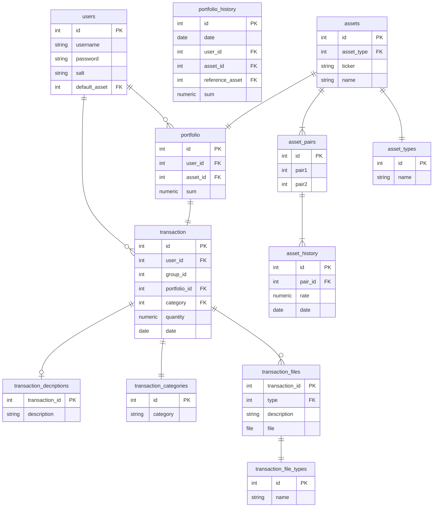

```mermaid
erDiagram
    users {
        int id PK
        string username
        string password
        string salt
        int default_asset FK
    }
    users ||--o{ portfolio : ""
    transaction }o--|| users : ""
    
 


    portfolio {
        int id PK
        int user_id FK
        int asset_id FK
        numeric sum
    }
    portfolio ||--|| transaction : ""

    portfolio_history {
        int id PK
        date date
        int user_id FK
        int asset_id FK
        int reference_asset FK
        numeric sum
    }


    transaction {
        int id PK
        int user_id FK
        int group_id
        int portfolio_id FK
        int category FK
        numeric quantity
        date date
    }

    transaction_categories {
        int id PK
        string category
    }

    transaction_decriptions {
        int transaction_id PK
        string description
    }

    transaction_files {
        int transaction_id PK
        int type FK
        string description
        file file
    }

    transaction_file_types {
        int id PK
        string name
    }
    transaction ||--o{ transaction_files : ""
    transaction ||--|| transaction_categories : ""
    transaction ||--o| transaction_decriptions : ""
    transaction_files ||--|| transaction_file_types : ""


    assets {
        int id PK
        int asset_type FK
        string ticker
        string name
    }

    asset_types {
        int id PK
        string name
    }

    asset_pairs {
        int id PK
        int pair1
        int pair2
    }

    asset_history {
        int id PK
        int pair_id FK
        numeric rate
        date date
    }
    assets ||--|| asset_types : ""
    assets ||--|{ asset_pairs : ""
    asset_pairs ||--|{ asset_history : ""
    assets ||--||  portfolio : ""

   

```