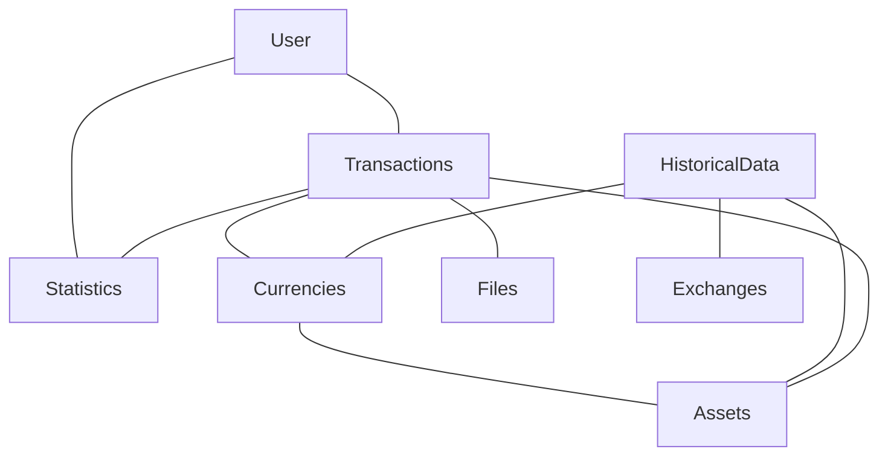

# Myra

## Overview
### What is myra?
Myra is an open source web application which lets you track all your finances in a single place, providing real time informaton of your assets and spending history.

With myra you can:
* Track your assets, such as stocks, ETFs, crypto, commodities, etc. 
* Track your daily income/expenses
* See your real time net worth as well as historical graph of it

### Why is myra?
There exists apps which can help you track your investments, such as [Delta](https://delta.app/en), or many other expense tracking apps. However, there is no app which lets you see it all in once place.

So what sets myra appart from other finance apps:
* All your financial management needs in one place
* Open source, so users can add their own features
* Can be self hosted and used on any device
* Modular - designed to be easily extensible

### Running the project
Just run `docker-compose up`

## Project outline 

### Domain model

### Minimum viable product:
1. User can create an account
1. User can enter income and or expenses and see history
1. User can enter owned aseets and purchase history to see their assets worth
1. User can see history of their net worth in graph or statistics form

### Stretch Goals:
1. Specific statistics for different categories, for instance information about car expenses (maintenance, fuel, €/l or €/km)
1. Integration with Open Banking
1. Integration with blockchain
1. Import export featues
1. Various calculators (for example compound interest calculator)
1. FIDO2 passwordless authentication
1. Native mobile app
1. Notifications

### Technological requiremens:
The application will use react for frontend. Rust will be used for the backend. It was chosen for performance and cross-platform capabilities. Postgres will be used for database. Jenkins or GitHub actions for CI/CD.

1. The project must be able to be run using a single docker-compose command
1. The development enviroment must be fully functional under a [dev container](https://containers.dev/).
1. The code must be modular - users should be able to create small modules that interface with the application. For example, a module for importing transactions using specific .csv file or a module for some kind of market data API integration.
1. The project utilizes OpenTelemetry
1. The project utilizes OpenApi or swagger
1. The project uses CI/CD and deploys automatically to prod, beta an dev enviroments
1. Both frontend and backend code must be covered by unit and integration tests
1. The code should be designed in a way where it can both run independently for each user or in a centralised way as a public web application.
